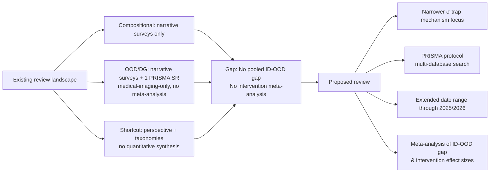

# Existing Reviews on OOD Generalization, Compositional Learning, and Shortcut Learning

**Document type:** Reference — protocol justification for Phase 1
**Purpose:** Demonstrates why a new systematic review is needed; no existing review quantifies ID-OOD gaps or performs intervention meta-analysis
**Status:** Draft

---

## Master Comparison Table

| # | Citation (short) | Review Type | # Papers Reviewed | Databases | Date Range | Key Findings | Gaps Identified | Meta-Analysis? |
|---|---|---|---|---|---|---|---|---|
| 1 | Geirhos et al. (2020) | Perspective / narrative | Not enumerated | None reported | Up to mid-2020 | Shortcut learning is a common failure mode; many OOD failures are symptoms of non-causal feature reliance | No formal protocol; no quantitative synthesis; no comparison of interventions | No |
| 2 | Liu et al. (2021/2023) | Narrative survey | Not stated | None reported | Through 2023 (v2) | Formalizes OOD generalization; categorizes methods into unsupervised, supervised, optimization | Lacks quantitative comparison; no protocol; benchmark evaluation inconsistent | No |
| 3 | Yu et al. (2024) | Narrative (evaluation focus) | Not stated | None reported | Through late 2023 | Three evaluation paradigms; benchmarks catalogued by modality | No pooled metrics; ID vs OOD flagged as future direction | No |
| 4 | Yang et al. (2024, IJCV) | Narrative (detection) | Not stated | None reported | 2017–2023 | Unifies OOD detection, anomaly detection, novelty detection, open-set recognition | No cross-benchmark comparison; limited intervention benchmarking | No |
| 5 | Zhou et al. (2023, TPAMI) | Narrative (domain gen.) | Not stated | None reported | ~2010–2022 | DG methods categorized: alignment, meta-learning, augmentation, ensemble | No pooled effect sizes; benchmark inconsistency | No |
| 6 | Wang et al. (2022, TKDE) | Narrative (domain gen.) | Not stated | None reported | ~2010–2021 | Categorizes DG algorithms: data manipulation, representation learning, learning strategy | No quantitative comparison; benchmark heterogeneity | No |
| 7 | Sinha et al. (2024) | Narrative (compositional) | Not stated | None reported | Through 2024 | Broadest coverage of compositional learning; identifies abstract compositionality concepts | "Lack of systematic theoretical and experimental research methodologies"; no quantitative aggregation | No |
| 8 | Hupkes et al. (2023, Nature MI) | Taxonomy + extensive review | **>700 experiments** | None reported (curated) | Through 2022/2023 | Five-axis taxonomy (motivation, generalization type, shift type, source, locus); 6 generalization types incl. compositional | NLP-scoped; no meta-analysis; no ID-OOD gap quantification | No |
| 9 | McCurdy et al. (2024, EMNLP) | Opinion survey + narrative | Survey of researchers (not paper count) | None reported | Through 2024 | Consensus: compositional behavior not solved by current models; scale alone insufficient | Not a systematic review; no benchmark synthesis | No |
| 10 | Matta et al. (2024) | **PRISMA-style SR** | **77 articles** | **Scopus** (till Apr 2023) | Through Apr 2023 | DG methods for medical image classification; shift-type taxonomy | **Medical imaging only**; single database; 77 papers; no meta-analysis | No |
| 11 | Karbasian et al. (2025) | Narrative taxonomy | Not stated | None reported | Through 2024 | Unified taxonomy of shortcuts; bridges bias, causality, security | No quantitative synthesis; no intervention comparison | No |
| 12 | Wang et al. (2025/2026, TMLR) | Narrative survey | Not stated | None reported | Through 2024 | Fine-grained taxonomy of spurious correlations; covers generative-AI era | No pooled effect sizes; no intervention comparison | No |
| 13 | Frontiers AI (2026) | Mini review | Not enumerated | None reported | 2020–2025 | Shortcut behaviors mapped across domains; detection/mitigation categorized data-centric vs model-centric | Mini review (not full SR); no meta-analysis | No |
| 14 | Liao et al. (2020) | Meta-review of 107 surveys | 107 surveys | Not reported | Through 2020 | Evaluation failures pervasive across ML fields | Not OOD-specific; no per-method quantitative pooling | No |

---

## Module Cards by Topic Area

### A. Compositional Generalization (3 reviews)

**Sinha et al. (2024)** — Broadest narrative survey covering cognitive, linguistic, and computational literature on compositional learning, including **LLMs**. Explicitly notes a "lack of systematic theoretical and experimental research methodologies" and offers no quantitative aggregation. Provides foundational definitions and task/benchmark catalog (SCAN, CFQ, COGS).

**Hupkes et al. (2023, Nature Machine Intelligence)** — Most empirically grounded review in this area; classifies **>700 experiments** along a five-axis taxonomy (motivation, generalization type, shift type, shift source, locus in pipeline). Identifies compositional generalization as one of six generalization types. However, NLP-scoped and performs no meta-analysis. No pooled ID-OOD gap data.

**McCurdy et al. (2024, EMNLP)** — Questionnaire-based opinion survey of researchers, not a systematic literature review. Reports that the field has consensus that compositional behavior is not solved by current models and scale alone is insufficient, but provides no benchmark-level quantitative synthesis.

### B. OOD / Out-of-Distribution Generalization (6 reviews)

**Liu et al. (2021/2023)** — Foundational methodological survey formalizing OOD generalization; categorizes methods into unsupervised representation learning, supervised model learning, and optimization. Claims "first comprehensive, systematic review" but lacks a formal PRISMA protocol and provides no quantitative comparison.

**Yu et al. (2024)** — Complements Liu et al. with an evaluation-focused survey; identifies three evaluation paradigms (OOD performance testing, performance prediction, intrinsic property characterization). Notably flags "distinguishing performance of OOD generalization from ID generalization" as an open future direction — confirming that no existing review has quantified this gap.

**Yang et al. (2024, IJCV)** — Extends to generalized OOD detection, unifying anomaly detection, novelty detection, open-set recognition, and outlier detection under a single method taxonomy. No quantitative cross-benchmark comparison; no meta-analysis.

**Zhou et al. (2023, TPAMI)** — Covers domain generalization specifically; categorizes methods into domain alignment, meta-learning, data augmentation, and ensemble learning. Covers CV, speech, and NLP applications. No pooled effect sizes; benchmark inconsistency acknowledged.

**Wang et al. (2022, TKDE)** — Categorizes DG algorithms into data manipulation, representation learning, and learning strategy. No quantitative comparison; benchmark heterogeneity acknowledged.

**Matta et al. (2024)** — The **only true PRISMA-style systematic review** in the entire OOD-adjacent literature. Covers 77 articles from Scopus through April 2023. However, restricted to **medical image classification**; searched only **one database**; performed **no meta-analysis**. Does not extend to NLP, RL, or general neural network settings.

### C. Shortcut Learning / Spurious Correlations (4 reviews)

**Geirhos et al. (2020, Nature Machine Intelligence)** — Seminal perspective piece framing shortcut learning as a unifying diagnosis of deep-learning OOD failures. Curated perspective, not systematic review. Illustrative examples across CV, NLP, RL, medical imaging. No quantitative synthesis.

**Karbasian et al. (2025)** — Most comprehensive taxonomy of shortcut learning; bridges bias, causality, and security. Compiles datasets and detection/mitigation methods. No quantitative synthesis; no intervention effectiveness comparison.

**Wang et al. (2025/2026, TMLR)** — Fine-grained method taxonomy and benchmark summary covering the generative-AI era. No pooled effect sizes; no intervention comparison.

**Frontiers AI (2026)** — Mini review mapping shortcut behaviors across domains; categorizes detection/mitigation as data-centric vs model-centric. Explicitly a mini review with no meta-analytic component.

### D. Meta-Review (1 review)

**Liao et al. (2020)** — Meta-review of 107 survey papers across CV, NLP, RecSys, RL. Finds evaluation failures are pervasive; advances evaporate under scrutiny. Not OOD-specific; no per-method quantitative pooling.

---

## The Two Decisive Questions

### Q1: Has any review quantified the ID-OOD gap across benchmarks?

**No.** Several primary empirical studies report shift gaps:
- TableShift reports "ΔAcc" between ID and OOD accuracy on tabular data
- Taori et al. evaluate 204 ImageNet models across 213 conditions
- "ID and OOD Performance Are Sometimes Inversely Correlated" documents inverse correlation
- WILDS reports ID-OOD gaps across real-world benchmarks

However, these are individual primary papers, not reviews or meta-analyses. No review aggregates ΔAcc (or analogous gap metrics) across benchmarks with pooled effect sizes. Yu et al. (2024) explicitly flags "distinguishing performance of OOD generalization from ID generalization" as a future direction — confirming this gap remains open.

### Q2: Has any review systematically compared interventions?

**No.** Narrative surveys qualitatively taxonomize intervention categories:
- Liu et al.: three-segment method categorization
- Karbasian et al.: detection/mitigation taxonomy
- Zhou et al.: DG method families

But none applies PRISMA inclusion criteria to intervention studies and none computes pooled effect sizes for any intervention class. The closest primary work — Taori et al. and synthetic-vs-natural-shifts studies — empirically compares robustness interventions on ImageNet but is not a review.

---

## Justification for the Proposed Review

### Four Differentiating Axes

| Axis | Existing Reviews | Proposed Review |
|---|---|---|
| **Scope** | Broad (OOD/DG/compositional/shortcut as separate categories) | **Narrower** — σ-trap mechanism as unifying diagnostic lens |
| **Protocol** | Only Matta et al. used PRISMA (medical imaging, single database, 77 papers) | **Full PRISMA protocol**, multi-database (IEEE Xplore, ACM DL, Scopus, WoS, PubMed, arXiv) |
| **Date range** | Most terminate at 2022–early 2023 | **Extended** through 2025/2026 (captures 2023–2026 surge in OOD/LLM compositional work) |
| **Meta-analysis** | **None** — all narrative surveys | **Pooled ID-OOD gaps + intervention effect sizes** (Cohen's d or analogous) |

### Non-redundancy argument

The proposed review is non-redundant with respect to every existing survey because:

1. **No review quantifies the ID-OOD gap** — Yu et al. (2024) explicitly flags this as future work
2. **No review compares interventions quantitatively** — all narrative taxonomies, no pooled effect sizes
3. **No review uses the σ-trap as a unifying mechanism** — the construct is absent from all located reviews
4. **No review extends a PRISMA protocol** to the full neural-network OOD literature across NLP, vision, and RL
5. **No review captures the 2023–2026 surge** in LLM compositional generalization and OOD robustness research

### Search completeness caveat

This scan relied on web-accessible indexing of major databases and the most-cited survey venues. A formal protocol-driven search of IEEE Xplore, ACM Digital Library, Scopus, Web of Science, PubMed, and Cochrane/CAMERA-adjacent ML registries (plus forward/backward citation chasing on the 14 reviews above) is recommended before finalizing the gap-justification statement, to rule out PRISMA-registered protocols not yet indexed by general search engines.

---

## References

- Geirhos, R., et al. (2020). Shortcut learning in deep neural networks. *Nature Machine Intelligence*, 2(11), 665–673.
- Hupkes, D., et al. (2023). A taxonomy and review of generalization research in NLP. *Nature Machine Intelligence*, 5, 1161–1174.
- Karbasian, A., et al. (2025). Navigating Shortcuts, Spurious Correlations, and Confounders. *arXiv*.
- Liao, T., et al. (2020). Are We Learning Yet? A Meta-Review of Evaluation Failures Across Machine Learning.
- Liu, J., et al. (2021/2023). Towards Out-Of-Distribution Generalization: A Survey. *arXiv*.
- Matta, M., et al. (2024). A systematic review of generalization research in medical image classification. *Computers in Biology and Medicine*.
- McCurdy, K., et al. (2024). Toward Compositional Behavior in Neural Models: A Survey of Current Views. *EMNLP*.
- Sinha, A., et al. (2024). A Survey on Compositional Learning of AI Models. *arXiv*.
- Wang, S., et al. (2022). Generalizing to Unseen Domains: A Survey on Domain Generalization. *IEEE TKDE*.
- Wang, X., et al. (2025/2026). The Clever Hans Mirage: A Survey on Spurious Correlations in ML. *TMLR*.
- Yang, J., et al. (2024). Generalized Out-of-Distribution Detection: A Survey. *IJCV*.
- Yu, Y., et al. (2024). A Survey on Evaluation of Out-of-Distribution Generalization. *arXiv*.
- Zhou, K., et al. (2023). Domain Generalization: A Survey. *IEEE TPAMI*, 45(4).
