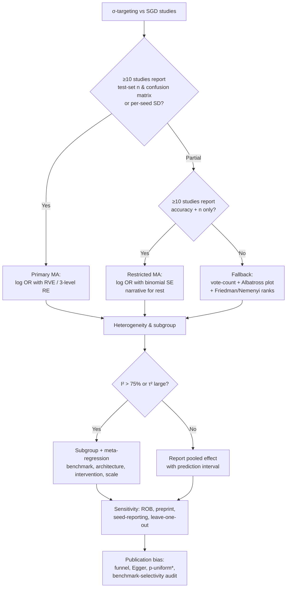

# Meta-Analysis Feasibility Assessment

**Document type:** Reference — informs Phase 9 synthesis strategy
**Purpose:** Evaluates whether a quantitative meta-analysis is feasible for σ-targeting vs. SGD interventions, provides effect-size choice, pooling model, subgroup strategy, and a statistical analysis plan
**Status:** Draft

---

## Feasibility Verdict

**Feasible with strong caveats.** A meta-analysis is justifiable *only* if ≥10–15 studies report either confusion-matrix counts or per-seed variance for σ-targeting vs. SGD on a comparable OOD benchmark; otherwise the review should default to a structured narrative synthesis with a vote-count/Albatross fallback. The dominant obstacles are (i) test-set-level variance is reported in a minority of ML papers, (ii) cross-benchmark pooling is confounded by benchmark difficulty, and (iii) σ-targeting studies (SAM, SWAD, ASAM, etc.) evaluate on heterogeneous OOD suites with non-overlapping baselines.



---

## 1. Effect Size Measure for Accuracy Data

Accuracy is a binomial proportion, not a continuous outcome, so standard medical-trial effect sizes require adaptation. Four candidates, ranked by suitability:

| Measure | When appropriate | Pros | Cons |
|---|---|---|---|
| **Log odds ratio (LOR)** | Primary choice when test-set size *n* and accuracy (or confusion matrix) are reported | Variance-stabilizing; benchmark-difficulty-invariant (relative measure); directly computable from n and accuracy | Loses absolute performance information; requires continuity correction when p=0 or 1 |
| **Hedges' g** | When ≥3 seeds reported per condition | Bias-corrected SMD; comparable across benchmarks; small-sample correction J≈1−3/(4df−1) | Requires per-seed SD, rarely reported; treats benchmark as "subject," conflating benchmark difficulty with intervention effect |
| **Cohen's d** | Same as Hedges' g but for large samples | Simple, familiar | Upward-biased for small samples; Hedges' g strictly dominates it for ML sample sizes |
| **Raw accuracy difference ΔAcc** | When *n* is unreported | Directly interpretable | Variance depends on baseline accuracy; not poolable across benchmarks with different difficulty; discouraged as primary |

**Recommended primary measure: log odds ratio (LOR)** of correct classification, computed per study as:

```
LOR_i = log[ p_σ(1−p_SGD) / (p_SGD(1−p_σ)) ]
V_i = 1/(n_i·p_σ(1−p_σ)) + 1/(n_i·p_SGD(1−p_SGD))
```

LOR is the natural choice because (a) it operates on the binomial outcome (correct/incorrect), (b) it is variance-stabilizing on the logit scale, (c) being a *relative* measure it partially absorbs benchmark difficulty — a 5% gain from 70%→75% and from 90%→95% yield different LORs, appropriately downweighting gains near ceiling, and (d) it is convertible to Cohen's d via d ≈ LOR × (√3/π) ≈ LOR/1.81 for cross-disciplinary interpretation.

**Secondary effect size: Hedges' g** on seed-level accuracy, restricted to the subset of studies reporting ≥3 seeds, since the within-seed SD captures genuine run-to-run variance that LOR's binomial SE does not. Avoid Cohen's d in preference to Hedges' g for the seed-level subset because ML per-condition sample sizes are typically small (3–5 seeds) where the bias correction matters.

**Tertiary (fallback):** Raw accuracy difference ΔAcc with binomial SE, pooled only within homogeneous benchmark families.

---

## 2. Handling Different Benchmark Difficulty Levels

Cross-benchmark pooling is the single most consequential analytic decision. Four strategies, in descending order of preference:

### Strategy A — Log odds ratio with benchmark-as-random-effect (preferred)

Because LOR is a *within-study relative* measure (σ vs. SGD on the same benchmark), the benchmark difficulty partially cancels out: a harder benchmark depresses both p_σ and p_SGD, leaving the odds-ratio scale comparable. Residual benchmark-level variance is then modeled as a random effect at level 2 in a three-level model (effect sizes nested within studies, studies nested within benchmark-clusters).

### Strategy B — Meta-regression with benchmark-difficulty covariates

Code each benchmark with (i) baseline SGD accuracy (a proxy for difficulty), (ii) shift type (covariate / concept / compositional / adversarial), (iii) shift severity (e.g., ID–OOD gap of the baseline). Include these as moderators in a random-effects meta-regression; this partitions heterogeneity into difficulty-attributable and intervention-attributable components.

### Strategy C — Stratified subgroup analysis by benchmark family

Pool separately within homogeneous benchmark families (e.g., WILDS, PACS/OfficeHome, COGS/SCAN, ImageNet-C) and report a family-level pooled estimate plus a test of subgroup differences (Q_between). This sacrifices power but yields interpretable, difficulty-matched estimates.

### Strategy D — Normalized gain (rarely viable)

Compute g_i = (Acc_σ − Acc_SGD) / (Acc_oracle − Acc_SGD) where an oracle or human-baseline ceiling is known; pool g_i. Only viable for benchmarks with established oracle performance (e.g., some WILDS tasks); not generalizable.

**Avoid** naïve pooling of raw accuracy differences across benchmarks — this conflates intervention effect with benchmark difficulty and produces a meaningless pooled estimate.

---

## 3. Random-Effects Model Appropriateness

A random-effects model is not merely appropriate — it is the **only defensible choice** given the expected heterogeneity sources: different architectures (ResNet, ViT, MLP), different benchmark families (covariate shift vs. compositional), different σ-targeting variants (SAM, ASAM, SWAD, entropy-SGD, MESA) with different perturbation radii, different model scales, different training-set sizes, and different OOD split severities. Fixed-effect assumptions (one true effect, differences due to sampling error alone) are untenable.

### Estimator recommendations

- **Hartung–Knapp–Sidik–Jonkman (HKSJ)** adjustment over DerSimonian–Laird, which gives better CI coverage when the number of studies is modest (k < 20)
- For the three-level / dependent-effect-size structure: **`rma.mv` in metafor** with random effects at the study and effect-size levels, combined with **robust variance estimation (RVE) with small-sample correction** (Tipton 2015, clubSandwich)
- Report τ² (between-study variance), *I*² (proportion of variance attributable to heterogeneity), and a **prediction interval** — the latter is critical because it conveys the range of effects expected in a future study, which matters more than the confidence interval when heterogeneity is high
- Expect *I*² > 75%; this is typical in ML meta-analyses and should not by itself trigger abandonment of pooling, but it does mandate subgroup/meta-regression exploration

---

## 4. Subgroup Analyses

Pre-specify the following subgroup analyses, each justified by a plausible effect modifier in the σ-targeting literature:

| Subgroup variable | Categories | Rationale |
|---|---|---|
| **Architecture family** | CNN (ResNet/DenseNet/ConvNeXt) / ViT / MLP / RNN-Transformer | SAM's flat-minima mechanism interacts with normalization layers and architecture inductive bias; perturbing only normalization parameters matches full-perturbation SAM in some architectures |
| **Intervention type** | SAM / ASAM / Friendly-SAM / Tilted-SAM / SWAD / Entropy-SGD / MESA / other σ-targeting | Mechanistic heterogeneity: SWAD averages weights, SAM perturbs gradients, ASAM adapts perturbation radius — expected differential OOD effect |
| **Benchmark family** | WILDS / domain-generalization (PACS, OfficeHome, VLCS, TerraIncognita, DomainNet) / corruption (ImageNet-C) / compositional (SCAN, CFQ, COGS) / synthetic shift | Different σ-targeting mechanisms may address different shift types; SWAD's theory targets domain generalization specifically |
| **Model scale** | small (<10M params) / medium (10M–1B) / large (>1B) | Sharpness–generalization link may weaken or strengthen with overparameterization; recent work questions scale invariance of SAM |
| **OOD shift severity** | mild / moderate / severe (stratify by baseline ID–OOD gap) | Effect of σ-targeting may compound or saturate with shift severity |
| **External validation status** | internal-only / external | Optimism-bias adjustment; external validation is the gold standard |
| **Seed reporting** | ≥3 seeds with SD / single seed / unspecified | Directly affects effect-size precision and ROB |
| **Perturbation radius ρ** | small (ρ<0.05) / medium / large | SAM's ρ is the key hyperparameter; effect is non-monotonic |

Each subgroup should be analyzed via mixed-effects meta-regression (subgroup as moderator) with RVE, reporting Q_between (test of subgroup differences) and the subgroup-specific pooled estimates with their own τ².

---

## 5. Minimum Studies Per Subgroup

| Threshold | Action |
|---|---|
| **k ≥ 10** | Pool and report subgroup estimate with full inference |
| **k = 5–9** | Report subgroup estimate with explicit low-power caveat and wide prediction interval |
| **k < 5** | Restrict to narrative description only |

Conventional thresholds:
- **Cochrane Handbook**: subgroup analyses are generally warranted only when the *total* pool includes ≥10 studies; within each subgroup, ≥10 studies is the frequently cited heuristic for the subgroup estimate to be meaningful
- **Power analysis**: detecting a moderate between-subgroup difference with 80% power requires ~22 studies in total for the main analysis; subgroup tests need roughly **3–4× the studies per unit**, so ~22 studies *per subgroup* for 80% power to detect a moderate subgroup effect
- **RVE small-sample validity**: Tipton (2015) showed RVE with the small-sample correction requires **k ≥ 10 studies** (some estimators ≥ 20) for acceptable Type-I error control; below this, CIs are too narrow and p-values anti-conservative
- **Funnel-plot / Egger validity**: ≥10 studies is the minimum for visual and regression-based asymmetry tests to be interpretable; below 10, false-positive and false-negative rates are both unacceptable

If the total pool is < 10 studies, abandon subgroup meta-analysis entirely and present a stratified narrative synthesis.

---

## 6. Handling Studies With Multiple OOD Splits

ML studies routinely evaluate on multiple OOD splits within the same benchmark family (e.g., WILDS Camelyon17 + FMoW + PovertyMap; PACS's four target domains). These produce **dependent effect sizes** that share the same model, training data, and partially the same benchmark, violating the independence assumption of conventional meta-analysis. Three defensible strategies, in order of preference:

### Strategy A — Three-level random-effects model with RVE (preferred)

Level 1 = sampling variance of each effect size; level 2 = effect-size level (within-study, capturing multiple splits/benchmarks); level 3 = study level (between-study). Fit with `rma.mv(yi, V, random = ~1 | study/es_id, data=dat)` in metafor, then apply `clubSandwich::coef_test` with the Tipton (2015) small-sample correction for valid standard errors and hypothesis tests. This is the consensus modern approach for dependent effect sizes.

### Strategy B — Robust variance estimation (RVE) alone

If the exact covariance among effect sizes from the same study is unknown, RVE with a working independence model and small-sample correction provides valid inference regardless of the true dependence structure; less efficient than the three-level model but more robust to misspecification. Use the `robumeta` package or `clubSandwich` on a fitted `rma.mv` model.

### Strategy C — Effect-size aggregation

When splits within a study are substantively equivalent (e.g., four PACS target domains), compute a study-level average effect size with inverse-variance weighting and an appropriately inflated variance (using the covariance among splits if recoverable, otherwise a conservative inflation factor). This sacrifices information but yields one independent effect per study, enabling standard two-level meta-analysis. Avoid simple unweighted averaging, which ignores differential precision.

**Never** enter all splits as independent effect sizes in a conventional random-effects model — this inflates Type-I error and artificially narrows CIs.

A companion Friedman/Nemenyi rank-based analysis (Demšar 2006) can supplement the parametric model when the goal is rank comparison rather than effect-size pooling.

---

## 7. Publication Bias Tests for ML Meta-Analysis

ML-specific publication bias differs from the medical paradigm: the suppression unit is often the *benchmark* (researchers report favorable benchmarks and omit unfavorable ones) rather than the *study*, and preprint publication is the norm rather than the exception.

| Test | Purpose | ML-specific caveats |
|---|---|---|
| **Contour-enhanced funnel plot** | Visual asymmetry detection | Needs ≥10 studies; asymmetry in ML may reflect benchmark-selective reporting, not study suppression |
| **Egger's regression** | Statistical test of funnel asymmetry (small-study effects) | Low power with <10 studies; conflate true heterogeneity with bias; use with HKSJ or RVE-based SEs |
| **Trim-and-fill (Duval & Tweedie)** | Impute missing studies; bias-adjusted pooled estimate | Assumes asymmetry = publication bias; in ML may misattribute benchmark-selectivity to study suppression |
| **p-uniform\*** | Estimate and adjust for selective reporting using distribution of significant p-values | More appropriate than p-curve when effects are heterogeneous; needs ≥10 studies |
| **p-curve** | Detect evidential value / p-hacking | Assumes p-hacking rather than testing it; can "correct" for non-existent bias; use cautiously in ML where p-values are rarely the primary inference currency |
| **Preprint–published comparison** | Compare pooled effect from preprints vs. peer-reviewed | ML-specific; divergence signals quality filtering or reviewer-induced selective reporting |
| **Benchmark-selectivity audit** | Within-study: compare reported vs. available benchmarks; test for selective benchmark choice | ML-specific; no off-the-shelf test; code whether the study reports all standard benchmarks for its intervention class |
| **Fail-safe N (Rosenthal)** | Robustness to unpublished null studies | Conservative and outdated; report only as supplementary |

**Recommended primary battery**: contour-enhanced funnel plot + Egger's regression (with RVE-based SEs) + p-uniform\* for adjustment + a benchmark-selectivity audit + preprint-vs-published subgroup comparison. Report trim-and-fill and fail-safe N as sensitivity-only.

---

## 8. Statistical Analysis Plan (SAP) Template

### SAP-1: Effect Size Definition
- **Primary effect size**: Log odds ratio (LOR) of correct classification.
  - LOR_i = log[ p_σ(1−p_SGD) / (p_SGD(1−p_σ)) ]
  - Variance: V_i = 1/(n_i·p_σ(1−p_σ)) + 1/(n_i·p_SGD(1−p_SGD))
  - Continuity correction 0.5/n applied when p=0 or p=1.
  - Report back-transformed OR and risk difference for interpretation.
- **Secondary effect size**: Hedges' g on seed-level accuracy, restricted to studies reporting ≥3 seeds with SD. Apply small-sample correction J.
- **Tertiary (fallback)**: Raw accuracy difference ΔAcc with binomial SE, pooled only within homogeneous benchmark families.

### SAP-2: Pooling Model
- **Primary**: Three-level random-effects model (effect sizes nested within studies, benchmark-cluster random effect).
  - Software: `metafor::rma.mv(yi, V, random = ~1 | study_id/es_id, struct="ID", method="REML")`
  - Apply `clubSandwich::coef_test` with Tipton (2015) small-sample RVE correction for all inference.
- **Estimator**: REML for variance components; HKSJ-adjusted CIs and p-values.
- **Secondary**: Pairwise random-effects (DerSimonian–Laird with HKSJ) on study-aggregated effects, as a sensitivity check.

### SAP-3: Heterogeneity Assessment
- Report τ², *I*² (with CI), Cochran's Q (with df and p), and the 95% prediction interval.
- Pre-specify that *I*² > 75% triggers mandatory subgroup/meta-regression exploration; it does NOT trigger abandonment of pooling.
- Leave-one-study-out influence analysis; Baujat plot.

### SAP-4: Subgroup & Meta-Regression Analyses

Pre-specified moderators (each tested via mixed-effects meta-regression with RVE; report Q_M for moderator, Q_E for residual heterogeneity):

| Moderator | Categories |
|---|---|
| Architecture family | CNN / ViT / MLP / other |
| Intervention type | SAM / ASAM / SWAD / Entropy-SGD / MESA / other |
| Benchmark family | WILDS / DG-suite / corruption / compositional / synthetic |
| Model scale | <10M / 10M–1B / >1B params |
| OOD shift severity | baseline ID–OOD gap: <10% / 10–25% / >25% |
| Perturbation radius ρ | for SAM-family: <0.05 / 0.05–0.2 / >0.2 |
| External validation | yes / no |
| Seed reporting | ≥3 seeds / single seed / unspecified |
| Preprint status | preprint / peer-reviewed |

Minimum k ≥ 10 per subgroup for pooling; k = 5–9 reported with low-power caveat; k < 5 narrative only.

### SAP-5: Sensitivity Analyses
- Exclude high-risk-of-bias studies (PROBAST+AI / REFORMS high ROB).
- Exclude preprints.
- Exclude studies with single-seed reporting.
- Exclude studies with data leakage flags.
- Restrict to externally validated studies.
- Restrict to studies reporting code/checkpoints.
- Leave-one-out (study-level and benchmark-level).
- Compare LOR-pooled vs. Hedges' g-pooled estimates (concordance check).

### SAP-6: Publication Bias & Selective Reporting
- Contour-enhanced funnel plot.
- Egger's regression (RVE-based SEs; ≥10 studies).
- Trim-and-fill (sensitivity, not primary correction).
- p-uniform\* for bias-adjusted pooled estimate (≥10 studies).
- 3-parameter selection model (3PSM) as alternative.
- Benchmark-selectivity audit: within-study ratio of reported-to-standard benchmarks; test for association between effect size and benchmark count.
- Preprint-vs-published subgroup comparison.
- Report all tests with explicit caveat that funnel asymmetry in ML may reflect benchmark-selective reporting rather than study suppression.

### SAP-7: Multiple-Outcomes Handling
- Three-level model handles multiple splits/benchmarks per study.
- Cross-design (multiple intervention variants in one study): use network meta-analysis component on the connected sub-network if transitivity holds; otherwise treat as multi-arm and split the comparator group's n to avoid double-counting.
- Multiple metrics (accuracy / F1 / AUC): report AUC and F1 as secondary meta-analyses; do not pool across metric types.

### SAP-8: Software & Reproducibility
- R ≥ 4.4; packages: metafor, clubSandwich, robumeta, dmetar, metagear.
- All code, extraction spreadsheets, and `rma.mv` model objects deposited in a public repository (OSF / Zenodo) with versioned DOI.
- PRISMA-AI (interim) and PRISMA-S reporting; ROB assessed with PROBAST+AI supplemented by REFORMS items.
- Protocol pre-registered on PROSPERO before extraction.

### SAP-9: Pre-Specified Stopping / Fallback Rules
- If <10 studies are eligible after full-text screening → abandon meta-analysis; deliver structured narrative synthesis with vote-count and Albatross plot.
- If ≥10 eligible but <10 report extractable effect sizes → restricted meta-analysis on the extractable subset + narrative for the remainder.
- If total *I*² > 90% and prediction interval crosses zero → report pooled estimate as exploratory only; emphasize subgroup estimates.

---

## References

- Demšar, J. (2006). Statistical Comparisons of Classifiers over Multiple Data Sets. *JMLR*, 7, 1–30.
- Tipton, E. (2015). Small sample adjustments for robust variance estimation with meta-regression. *Psychological Methods*, 20(3), 361–375.
- Viechtbauer, W. (2010). Conducting Meta-Analyses in R with the metafor Package. *JSS*, 36(3).
