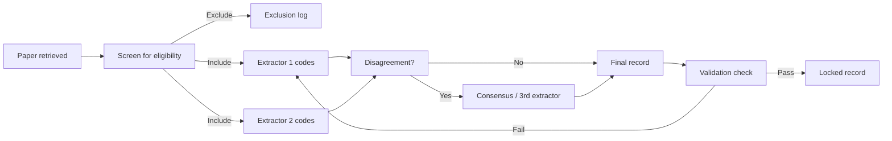

# Data Extraction Template: σ-Trap Systematic Review

**Document type:** Reference — feeds Phase 7 (Data Extraction & Charting)
**Purpose:** Structured extraction form with 80 fields, controlled vocabularies, validation rules, and IRR protocol for systematic coding of included studies
**Status:** Draft
**Cross-references:** `meta-analysis-feasibility.md` §8 (SAP), `review-methodology.md` §3 (ROB tools), `quality-criteria.md` §8 (IRR protocol), `landmark-papers.md` (benchmark names), `interventions.md` (intervention names), `coherence-proxies.md` (proxy measures)

---

## 0. Extractor Instructions

Before coding, read the full text. Code at the study level (one row per paper), not the experiment level. If a paper reports multiple experiments, use the **Sub-experiment form** (§3) linked to the main record. Two independent extractors code each paper; disagreements resolved by consensus or third extractor. Pilot on 5 papers before full extraction. All text fields use UTF-8; numeric fields use "." as decimal separator.



---

## 1. Main Extraction Form

### §1A: Bibliographic Information

| # | Field | Type | Required | Controlled vocabulary / format | Validation rule |
|---|---|---|---|---|---|
| 1 | `paper_id` | String (PXXX) | Yes | P001–P999 | Unique; zero-padded 3 digits |
| 2a | `title` | Text | Yes | Free text | Non-empty; strip trailing whitespace |
| 2b | `authors` | Text | Yes | "Last1, F.M.; Last2, F.M.; …" | Semicolon-separated; ≥1 author |
| 2c | `year` | Integer | Yes | 1990–2026 | 4-digit year |
| 2d | `venue` | Text | Yes | Full venue name (journal, conference, or "arXiv preprint") | Non-empty |
| 2e | `doi` | Text | No | 10.XXXX/... | Valid DOI pattern or empty |
| 2f | `arxiv_id` | Text | No | 2401.12345 or 2401.12345v2 | arXiv ID pattern or empty |
| 2g | `peer_reviewed` | Boolean | Yes | {TRUE, FALSE} | TRUE if published in peer-reviewed venue |

### §1B: Publication Type

| # | Field | Type | Required | Controlled vocabulary | Validation rule |
|---|---|---|---|---|---|
| 3 | `pub_type` | Categorical | Yes | {empirical, theoretical, review, position, dataset_benchmark, survey_ma, other} | Single value |
| 3a | `pub_type_other` | Text | Conditional | Free text | Required if `pub_type` = other |

### §1C: Task & Benchmark

| # | Field | Type | Required | Controlled vocabulary | Validation rule |
|---|---|---|---|---|---|
| 4a | `task_primary` | Categorical | Yes | See §2.1 Task vocabulary | Single primary task |
| 4b | `tasks_secondary` | List[categorical] | No | See §2.1 | Comma-separated; empty if none |
| 4c | `task_custom_name` | Text | Conditional | Free text | Required if `task_primary` = custom |
| 4d | `ood_split_type` | Categorical | Yes | {compositional, covariate_shift, concept_shift, label_shift, domain_shift, adversarial, temporal, none, mixed} | Single value |

### §1D: Model Architecture

| # | Field | Type | Required | Controlled vocabulary | Validation rule |
|---|---|---|---|---|---|
| 5a | `arch_primary` | Categorical | Yes | See §2.2 Architecture vocabulary | Single primary architecture |
| 5b | `arch_family` | Categorical | Yes | {rnn_family, transformer, cnn_family, mlp, vit, gnn, neurosymbolic, ode, diffusion, other} | Single value |
| 5c | `arch_detail` | Text | No | Free text (e.g., "6-layer Transformer, 8 heads") | Max 200 chars |

### §1E: Model Scale

| # | Field | Type | Required | Controlled vocabulary | Validation rule |
|---|---|---|---|---|---|
| 6a | `param_count` | Integer | No | >0 | Number of trainable parameters |
| 6b | `n_layers` | Integer | No | >0 | Depth |
| 6c | `hidden_dim` | Integer | No | >0 | Hidden dimensionality |
| 6d | `model_scale_category` | Categorical | Yes | {small: <1M, medium: 1M–100M, large: 100M–10B, xl: >10B, unspecified} | Single value |

### §1F: Training Data

| # | Field | Type | Required | Controlled vocabulary | Validation rule |
|---|---|---|---|---|---|
| 7a | `train_n_examples` | Integer | No | >0 | Number of training examples |
| 7b | `train_n_tokens` | Integer | No | >0 | If NLP, number of training tokens |
| 7c | `train_data_note` | Text | No | Free text | Max 200 chars |

### §1G: Training Regime

| # | Field | Type | Required | Controlled vocabulary | Validation rule |
|---|---|---|---|---|---|
| 8a | `train_regime` | Categorical | Yes | See §2.3 Training regime vocabulary | Single primary regime |
| 8b | `train_regime_sigma` | Categorical | Conditional | {SAM, ASAM, Friendly-SAM, Tilted-SAM, SWAD, entropy-SGD, MESA, other_sigma, not_applicable} | Required if `train_regime` = sigma_coupled |
| 8c | `train_regime_other` | Text | Conditional | Free text | Required if `train_regime` = other |
| 8d | `baseline_regime` | Categorical | Yes | {standard_SGD, standard_Adam, other} | Baseline comparator |
| 8e | `augmentation_used` | Boolean | Yes | {TRUE, FALSE} | |
| 8f | `augmentation_type` | Text | Conditional | Free text | Required if `augmentation_used` = TRUE |
| 8g | `curriculum_used` | Boolean | Yes | {TRUE, FALSE} | |
| 8h | `meta_learning_used` | Boolean | Yes | {TRUE, FALSE} | |

### §1H: ID Results

| # | Field | Type | Required | Controlled vocabulary | Validation rule |
|---|---|---|---|---|---|
| 9a | `id_acc_mean` | Numeric | No | 0–1 | In-distribution accuracy |
| 9b | `id_acc_sd` | Numeric | No | ≥0 | SD across seeds |
| 9c | `id_acc_n_seeds` | Integer | No | ≥1 | Number of random seeds |
| 9d | `id_acc_n_test` | Integer | No | >0 | Test-set size |
| 9e | `id_acc_ci_lower` | Numeric | No | 0–1 | 95% CI lower bound |
| 9f | `id_acc_ci_upper` | Numeric | No | 0–1 | 95% CI upper bound |
| 9g | `id_metric_type` | Categorical | Yes | {accuracy, F1, AUC, BLEU, exact_match, other} | Single value |
| 9h | `id_metric_other` | Text | Conditional | Free text | Required if `id_metric_type` = other |

### §1I: OOD Results

| # | Field | Type | Required | Controlled vocabulary | Validation rule |
|---|---|---|---|---|---|
| 10a | `ood_acc_mean` | Numeric | No | 0–1 | OOD accuracy |
| 10b | `ood_acc_sd` | Numeric | No | ≥0 | SD across seeds |
| 10c | `ood_acc_n_seeds` | Integer | No | ≥1 | Number of random seeds |
| 10d | `ood_acc_n_test` | Integer | No | >0 | Test-set size |
| 10e | `ood_acc_ci_lower` | Numeric | No | 0–1 | 95% CI lower bound |
| 10f | `ood_acc_ci_upper` | Numeric | No | 0–1 | 95% CI upper bound |
| 10g | `ood_metric_type` | Categorical | Yes | {accuracy, F1, AUC, BLEU, exact_match, other} | Single value |
| 10h | `ood_metric_other` | Text | Conditional | Free text | Required if `ood_metric_type` = other |

### §1J: ID-OOD Gap (Calculated)

| # | Field | Type | Required | Controlled vocabulary | Validation rule |
|---|---|---|---|---|---|
| 11a | `id_ood_gap_raw` | Numeric | Calculated | `id_acc_mean` − `ood_acc_mean` | Auto-computed if both present |
| 11b | `id_ood_gap_se` | Numeric | Calculated | √(SD_id²/n_id + SD_ood²/n_ood) | Auto-computed if SDs and n present |
| 11c | `id_ood_gap_reported` | Numeric | No | Free numeric | If paper reports gap directly |

### §1K: Effect Size

| # | Field | Type | Required | Controlled vocabulary | Validation rule |
|---|---|---|---|---|---|
| 12a | `effect_size_type` | Categorical | Yes | {log_odds_ratio, hedges_g, cohens_d, raw_delta, none, other} | Single value |
| 12b | `effect_size_value` | Numeric | Conditional | Real | Required if `effect_size_type` ≠ none |
| 12c | `effect_size_se` | Numeric | Conditional | ≥0 | Standard error of effect size |
| 12d | `effect_size_ci_lower` | Numeric | Conditional | Real | 95% CI lower |
| 12e | `effect_size_ci_upper` | Numeric | Conditional | Real | 95% CI upper |
| 12f | `effect_size_computed_by_extractor` | Boolean | Yes | {TRUE, FALSE} | TRUE if re-derived from confusion matrix |
| 12g | `effect_size_notes` | Text | No | Free text | Max 300 chars |

### §1L: Schema Coherence

| # | Field | Type | Required | Controlled vocabulary | Validation rule |
|---|---|---|---|---|---|
| 13a | `schema_coherence_measured` | Boolean | Yes | {TRUE, FALSE} | |
| 13b | `schema_coherence_proxy` | Categorical | Conditional | See §2.4 Schema coherence vocabulary | Required if 13a = TRUE |
| 13c | `schema_coherence_proxy_other` | Text | Conditional | Free text | Required if 13b = other |
| 13d | `schema_coherence_value_intervention` | Numeric | No | Real | Value for σ-targeting condition |
| 13e | `schema_coherence_value_baseline` | Numeric | No | Real | Value for baseline condition |
| 13f | `schema_coherence_notes` | Text | No | Free text | Max 300 chars |

### §1M: Internal Representation Analysis

| # | Field | Type | Required | Controlled vocabulary | Validation rule |
|---|---|---|---|---|---|
| 14a | `repr_analysis` | Categorical | Yes | {probing, RSA, CKA, clustering, PCA, SAE, attention_patterns, CAV, activation_max, none, other} | Single primary method |
| 14b | `repr_analysis_secondary` | List[categorical] | No | Same as 14a | Comma-separated |
| 14c | `repr_analysis_finding` | Text | No | Free text | Max 300 chars |
| 14d | `repr_analysis_layer` | Text | No | Free text (e.g., "layer 4", "residual stream") | Max 100 chars |

### §1N: Statistical Rigor

| # | Field | Type | Required | Controlled vocabulary | Validation rule |
|---|---|---|---|---|---|
| 15a | `ci_reported` | Boolean | Yes | {TRUE, FALSE} | Confidence intervals reported anywhere |
| 15b | `error_bars_reported` | Boolean | Yes | {TRUE, FALSE} | Error bars on plots |
| 15c | `n_seeds_reported` | Boolean | Yes | {TRUE, FALSE} | Whether number of seeds is stated |
| 15d | `n_seeds_value` | Integer | Conditional | ≥1 | Required if 15c = TRUE |
| 15e | `sig_test_reported` | Boolean | Yes | {TRUE, FALSE} | |
| 15f | `sig_test_type` | Categorical | Conditional | {t-test, wilcoxon, bootstrap, permutation, friedman, ANOVA, other, none} | Required if 15e = TRUE |
| 15g | `sig_test_pvalue` | Numeric | No | 0–1 | If reported |
| 15h | `multiple_testing_correction` | Categorical | Yes | {bonferroni, holm, BH, none, other, unclear} | |
| 15i | `data_leakage_check` | Categorical | Yes | {explicit_no, not_addressed, suspected, confirmed_yes} | |

### §1O: Code & Data Availability

| # | Field | Type | Required | Controlled vocabulary | Validation rule |
|---|---|---|---|---|---|
| 16a | `code_available` | Boolean | Yes | {TRUE, FALSE} | |
| 16b | `code_url` | Text | Conditional | URL | Required if 16a = TRUE |
| 16c | `data_available` | Boolean | Yes | {TRUE, FALSE} | |
| 16d | `data_url` | Text | Conditional | URL | Required if 16c = TRUE |
| 16e | `model_weights_available` | Boolean | Yes | {TRUE, FALSE} | |
| 16f | `reproducibility_score` | Categorical | Yes | {high: all 3, medium: code+data, low: none, partial: 1 of 3} | Based on 16a, 16c, 16e |

### §1P: Relevance Scoring

| # | Field | Type | Required | Controlled vocabulary | Validation rule |
|---|---|---|---|---|---|
| 17a | `relevance_sigma_trap` | Ordinal | Yes | 1–5 | See §2.5 Relevance rubric |
| 17b | `relevance_sigma_justification` | Text | Yes | Free text | ≥50 chars; ≤300 chars |
| 18a | `relevance_alignment` | Ordinal | Yes | 1–5 | See §2.5 Relevance rubric |
| 18b | `relevance_alignment_justification` | Text | Yes | Free text | ≥50 chars; ≤300 chars |

### §1Q: Limitations & Open Questions

| # | Field | Type | Required | Controlled vocabulary | Validation rule |
|---|---|---|---|---|---|
| 19a | `limitations_stated` | Boolean | Yes | {TRUE, FALSE} | Authors state limitations |
| 19b | `limitations_text` | Text | Conditional | Free text | Required if 19a = TRUE; ≤500 chars |
| 19c | `limitations_extractor` | Text | No | Free text | Extractor-identified limitations not stated by authors; ≤300 chars |
| 20a | `open_questions_stated` | Boolean | Yes | {TRUE, FALSE} | Authors raise open questions |
| 20b | `open_questions_text` | Text | Conditional | Free text | Required if 20a = TRUE; ≤500 chars |
| 20c | `open_questions_extractor` | Text | No | Free text | Extractor-identified gaps; ≤300 chars |

---

## 2. Controlled Vocabulary Codebook

### §2.1 Task / Benchmark Vocabulary

| Code | Task | Domain | Shift type |
|---|---|---|---|
| `SCAN` | SCAN (Lake & Baroni 2018) | NLP / compositional | Compositional |
| `COGS` | COGS (Kim & Linzen 2020) | NLP / compositional | Compositional |
| `CFQ` | Compositional Freebase Questions | NLP / compositional | Compositional |
| `PCFG_SET` | PCFG Set (Hupkes et al. 2020) | NLP / compositional | Compositional |
| `gSCAN` | gSCAN (Ruis et al. 2020) | Multimodal / compositional | Compositional |
| `CREAK` | CREAK | NLP / reasoning | Compositional |
| `GeoQuery` | GeoQuery | NLP / semantic parsing | Compositional |
| `WILDS` | WILDS benchmark suite | Vision / NLP / tabular | Domain shift |
| `PACS` | PACS | Vision / DG | Domain shift |
| `OfficeHome` | OfficeHome | Vision / DG | Domain shift |
| `VLCS` | VLCS | Vision / DG | Domain shift |
| `TerraIncognita` | TerraIncognita | Vision / DG | Domain shift |
| `DomainNet` | DomainNet | Vision / DG | Domain shift |
| `ImageNet_C` | ImageNet-C | Vision / robustness | Covariate shift |
| `ImageNet_R` | ImageNet-R | Vision / robustness | Covariate shift |
| `ImageNet_A` | ImageNet-A | Vision / robustness | Covariate shift |
| `Camelyon17` | WILDS-Camelyon17 | Medical imaging | Domain shift |
| `FMoW` | WILDS-FMoW | Satellite imaging | Domain shift |
| `PovertyMap` | WILDS-PovertyMap | Satellite / tabular | Domain shift |
| `CivilComments` | WILDS-CivilComments | NLP | Spurious correlation |
| `MNIST` | MNIST | Vision | — |
| `CIFAR10` | CIFAR-10 | Vision | — |
| `CIFAR100` | CIFAR-100 | Vision | — |
| `ImageNet` | ImageNet | Vision | — |
| `ColoredMNIST` | Colored MNIST | Vision / spurious | Spurious correlation |
| `Waterbirds` | Waterbirds | Vision / spurious | Spurious correlation |
| `CelebA` | CelebA | Vision / spurious | Spurious correlation |
| `MultiNLI` | MultiNLI | NLP | — |
| `HANS` | HANS | NLI | Spurious correlation |
| `BBQ` | BBQ | QA | Bias |
| `custom` | Custom task (specify in 4c) | — | — |
| `other` | Other (specify) | — | — |

**OOD split type (`4d`) definitions:**
- `compositional`: novel combinations of known primitives
- `covariate_shift`: P(X) changes, P(Y|X) constant
- `concept_shift`: P(Y|X) changes
- `label_shift`: P(Y) changes
- `domain_shift`: domain/context changes (subset of covariate shift)
- `adversarial`: adversarial perturbations
- `temporal`: time-based shift
- `none`: no OOD evaluation
- `mixed`: multiple shift types in one benchmark

### §2.2 Architecture Vocabulary

| `arch_primary` code | Description | `arch_family` |
|---|---|---|
| `LSTM` | Long Short-Term Memory | rnn_family |
| `GRU` | Gated Recurrent Unit | rnn_family |
| `VanillaRNN` | Simple RNN | rnn_family |
| `TransformerEnc` | Transformer encoder | transformer |
| `TransformerDec` | Transformer decoder | transformer |
| `TransformerEncDec` | Transformer encoder-decoder | transformer |
| `BERT` | BERT-style | transformer |
| `GPT` | GPT-style decoder | transformer |
| `T5` | T5-style encoder-decoder | transformer |
| `ResNet` | Residual network | cnn_family |
| `DenseNet` | Dense connection network | cnn_family |
| `ConvNeXt` | ConvNeXt | cnn_family |
| `ViT` | Vision Transformer | vit |
| `Swin` | Swin Transformer | vit |
| `MLP` | Multi-layer perceptron | mlp |
| `MLPMixer` | MLP-Mixer | mlp |
| `GCN` | Graph Convolutional Network | gnn |
| `GAT` | Graph Attention Network | gnn |
| `NeuralSymbolic` | Neuro-symbolic architecture | neurosymbolic |
| `ODE` | ODE-based network | ode |
| `Diffusion` | Diffusion model | diffusion |
| `other` | Other (specify) | other |

### §2.3 Training Regime Vocabulary

| `train_regime` code | Description | σ-coupled? |
|---|---|---|
| `standard_SGD` | Standard stochastic gradient descent | No |
| `standard_Adam` | Adam-family optimizer | No |
| `momentum` | Momentum / Nesterov | No |
| `curriculum` | Curriculum learning | No |
| `augmentation` | Data augmentation as primary intervention | No |
| `multi_task` | Multi-task training | No |
| `meta_learning` | Meta-learning (MAML, Reptile, MLC) | No |
| `sigma_coupled` | σ-targeting intervention | Yes (specify in 8b) |
| `contrastive` | Contrastive learning | No |
| `invariant_learning` | Invariant Risk Minimization (IRM) or variant | No |
| `adversarial_train` | Adversarial training | No |
| `regularized` | Explicit regularizer (e.g., L1, L2, sparsity) | No |
| `other` | Other (specify in 8c) | — |

**σ-coupled subtypes (`8b`):**

| Code | Full name | Key reference |
|---|---|---|
| `SAM` | Sharpness-Aware Minimization | Foret et al. 2021 |
| `ASAM` | Adaptive SAM | Kwon et al. 2021 |
| `Friendly-SAM` | Friendly SAM | Kwon et al. 2023 |
| `Tilted-SAM` | Tilted SAM | ICML 2025 |
| `SWAD` | Stochastic Weight Averaging Densely | Cha et al. 2021 |
| `entropy-SGD` | Entropy-SGD | Chaudhari et al. 2019 |
| `MESA` | Meta-learned Sharpness-Aware | Liu et al. 2022 |
| `other_sigma` | Other σ-targeting | — |
| `not_applicable` | Not a σ-coupled regime | — |

### §2.4 Schema Coherence Proxy Vocabulary

Candidate operationalizations of the σ-trap mediator. If a paper measures any of these, code `schema_coherence_measured` = TRUE and specify.

| Code | Description | Direction (higher = ?) |
|---|---|---|
| `linear_probe_acc` | Linear probe accuracy on held-out compositional labels | Higher = more coherent |
| `CKA` | Centered Kernel Alignment between layers or models | Depends on comparison |
| `RSA` | Representational Similarity Analysis | Depends on comparison |
| `effective_rank` | Effective rank of activation matrix | Higher = more diverse |
| `disentanglement_metric` | DCI disentanglement or similar | Higher = more disentangled |
| `mutual_info` | Mutual information between factors and representations | Higher = more informative |
| `causal_probe_acc` | Accuracy of causal probing (interventional) | Higher = more causal |
| `logical_consistency` | Logical consistency score (e.g., NLI entailment preservation) | Higher = more coherent |
| `compositionality_score` | Compositionality score (e.g., compositional generalization gap) | Higher = more compositional |
| `feature_sparsity` | Sparsity of active features | Depends |
| `cluster_purity` | Purity of representation clusters by ground-truth factor | Higher = more coherent |
| `attention_entropy` | Entropy of attention distributions | Lower = more focused |
| `neuron_monosemanticity` | Fraction of monosemantic neurons (via SAE or manual) | Higher = more coherent |
| `other` | Other (specify in 13c) | — |

### §2.5 Relevance Rubrics

#### Relevance to σ-trap (field 17a)

| Score | Definition | Example |
|---|---|---|
| 1 | **Not relevant**: Mentions shortcut learning or OOD generalization only in passing; no direct measurement of σ-trap mechanism | A paper on dataset bias that does not address training dynamics or sharpness |
| 2 | **Tangentially relevant**: Studies a related phenomenon (e.g., adversarial robustness) without connecting to schema coherence or σ-targeting | An adversarial-training paper that does not measure flatness or compositional generalization |
| 3 | **Moderately relevant**: Directly measures one component of the σ-trap (shortcut reliance, flatness, compositional failure, or OOD gap) without integrating them | A benchmark paper reporting OOD accuracy gaps across architectures |
| 4 | **Highly relevant**: Measures ≥2 components of the σ-trap or tests a σ-targeting intervention with OOD evaluation | A SAM-vs-SGD comparison on WILDS with seed-level variance |
| 5 | **Directly central**: Explicitly tests the σ-trap hypothesis, measures schema coherence as a mediator, or proposes a σ-trap-specific intervention | A paper that shows flat-minima-seeking methods improve compositional generalization via increased schema coherence |

#### Relevance to alignment / safety (field 18a)

| Score | Definition | Example |
|---|---|---|
| 1 | **Not relevant**: No connection to AI safety, alignment, or goal misgeneralization | A pure architecture-search paper |
| 2 | **Tangentially relevant**: Discusses robustness or generalization in a safety-adjacent context without connecting to alignment failure | A domain-generalization paper mentioning autonomous driving as motivation |
| 3 | **Moderately relevant**: Studies goal misgeneralization, reward hacking, or specification gaming, or studies OOD generalization in an RL agent setting | A goal-misgeneralization paper in CoinRun |
| 4 | **Highly relevant**: Directly measures representation-level mechanisms underlying alignment failure (deception probes, reward-model shortcuts, alignment faking) | A paper showing reward models exploit length shortcuts |
| 5 | **Directly central**: Explicitly connects σ-trap dynamics (schema coherence, shortcut reliance, flatness) to alignment failure or deceptive alignment | A paper demonstrating that σ-targeting interventions reduce goal misgeneralization |

---

## 3. Sub-experiment Form

For papers reporting multiple experiments (e.g., multiple architectures, multiple benchmarks, multiple interventions), complete one sub-experiment row per unique configuration. Link to main record via `paper_id`.

| # | Field | Type | Required | Controlled vocabulary | Validation rule |
|---|---|---|---|---|---|
| S1 | `sub_exp_id` | String | Yes | `{paper_id}_E001` | Unique; zero-padded |
| S2 | `paper_id` | String | Yes | P001–P999 | Foreign key to main form |
| S3 | `experiment_label` | Text | Yes | Free text (short label) | ≤50 chars |
| S4 | `task` | Categorical | Yes | See §2.1 | Single task |
| S5 | `arch` | Categorical | Yes | See §2.2 | Single architecture |
| S6 | `train_regime` | Categorical | Yes | See §2.3 | Single regime |
| S7 | `id_acc_mean` | Numeric | No | 0–1 | |
| S8 | `id_acc_sd` | Numeric | No | ≥0 | |
| S9 | `id_acc_n_seeds` | Integer | No | ≥1 | |
| S10 | `ood_acc_mean` | Numeric | No | 0–1 | |
| S11 | `ood_acc_sd` | Numeric | No | ≥0 | |
| S12 | `ood_acc_n_seeds` | Integer | No | ≥1 | |
| S13 | `id_ood_gap` | Numeric | Calculated | S7 − S10 | |
| S14 | `effect_size_type` | Categorical | Yes | See field 12a | |
| S15 | `effect_size_value` | Numeric | Conditional | Real | |
| S16 | `effect_size_se` | Numeric | Conditional | ≥0 | |
| S17 | `schema_coherence_value` | Numeric | No | Real | |
| S18 | `notes` | Text | No | Free text | ≤300 chars |

---

## 4. Validation Rules

### §4.1 Cross-field Validation

| Rule ID | Fields | Rule | Error type |
|---|---|---|---|
| V01 | 9a, 9d | If `id_acc_mean` is present, `id_acc_n_test` should be present | Warning |
| V02 | 10a, 10d | If `ood_acc_mean` is present, `ood_acc_n_test` should be present | Warning |
| V03 | 9b, 9c | If `id_acc_sd` is present, `id_acc_n_seeds` should be ≥2 | Error |
| V04 | 10b, 10c | If `ood_acc_sd` is present, `ood_acc_n_seeds` should be ≥2 | Error |
| V05 | 11a | `id_ood_gap_raw` should equal `id_acc_mean` − `ood_acc_mean` (±0.001) | Error |
| V06 | 12a, 12b | If `effect_size_type` ≠ none, `effect_size_value` must be present | Error |
| V07 | 8a, 8b | If `train_regime` = sigma_coupled, `train_regime_sigma` must be ≠ not_applicable | Error |
| V08 | 13a, 13b | If `schema_coherence_measured` = TRUE, `schema_coherence_proxy` must be present | Error |
| V09 | 15c, 15d | If `n_seeds_reported` = TRUE, `n_seeds_value` must be ≥1 | Error |
| V10 | 15e, 15f | If `sig_test_reported` = TRUE, `sig_test_type` must be ≠ none | Error |
| V11 | 16a, 16b | If `code_available` = TRUE, `code_url` should be present | Warning |
| V12 | 16c, 16d | If `data_available` = TRUE, `data_url` should be present | Warning |
| V13 | 17a, 17b | If `relevance_sigma_trap` ≥ 4, `relevance_sigma_justification` must be ≥100 chars | Error |
| V14 | 18a, 18b | If `relevance_alignment` ≥ 4, `relevance_alignment_justification` must be ≥100 chars | Error |
| V15 | 4d | If `ood_split_type` = none, fields 10a–10h should be empty | Error |
| V16 | 9g, 10g | `id_metric_type` and `ood_metric_type` should match for gap calculation | Warning |
| V17 | 12a, 12f | If `effect_size_computed_by_extractor` = TRUE, `effect_size_notes` should explain derivation | Warning |
| V18 | 3, 19a | If `pub_type` = review, `limitations_stated` may be FALSE | Info |
| V19 | 6a, 6d | `model_scale_category` should be consistent with `param_count` | Warning |
| V20 | 8b | If `train_regime_sigma` = SAM, check if ρ (perturbation radius) is reported in notes | Warning |

### §4.2 Completeness Thresholds

| Threshold | Rule |
|---|---|
| **Tier 1 (full extraction)** | All required fields present; ≥80% of optional fields present; effect size derivable or reported |
| **Tier 2 (partial extraction)** | Required fields present; <80% of optional fields; effect size not derivable; included in narrative synthesis only |
| **Tier 3 (extraction failed)** | <50% of required fields present; contact authors; if no response in 4 weeks, exclude with reason |

---

## 5. Inter-Rater Reliability Protocol

### §5.1 Pilot Phase

1. Two extractors independently code the same 5 papers.
2. Compute Cohen's κ for categorical fields and ICC(2,1) for numeric fields.
3. Target: κ ≥ 0.70 for categorical; ICC ≥ 0.80 for numeric.
4. If below target, revise codebook and re-pilot on 5 new papers.

### §5.2 Full Extraction Phase

1. Double-code all papers.
2. Disagreements resolved by discussion.
3. Persistent disagreements escalated to third extractor (senior reviewer).
4. Compute ongoing κ/ICC on every 20th paper to monitor drift.
5. Report final κ/ICC in the review's method section.

### §5.3 Fields Requiring Particular Attention

| Field | Risk | Mitigation |
|---|---|---|
| `effect_size_value` (12b) | Re-derivation errors | Third extractor verifies all computed effect sizes |
| `schema_coherence_proxy` (13b) | Novel concept; low familiarity | Training session + coding examples before pilot |
| `relevance_sigma_trap` (17a) | Subjective; central to inclusion | Two extractors + consensus; document decision logic |
| `data_leakage_check` (15i) | Requires deep methods reading | Code only from explicit statements; mark "not_addressed" if silent |
| `ood_split_type` (4d) | Conflation of shift types | Use decision tree below |

### §5.4 OOD Split Type Decision Tree

```
Are test examples novel combinations of known primitives?
  YES → compositional
  NO → Does P(X) change while P(Y|X) is constant?
    YES → Is the change in domain/context (e.g., hospital, camera)?
      YES → domain_shift
      NO → covariate_shift
    NO → Does P(Y|X) change?
      YES → concept_shift
      NO → Does P(Y) change?
        YES → label_shift
        NO → Are inputs adversarially perturbed?
          YES → adversarial
          NO → Is the shift time-based?
            YES → temporal
            NO → none
```

---

## 6. Edge-case Handling

| Case | Rule |
|---|---|
| Paper reports only "best-of-N-seeds" accuracy | Code `n_seeds_value` as N; note in `effect_size_notes` that only best-seed reported; flag as high risk of bias |
| Paper reports accuracy without test-set size | Code `id_acc_n_test` as empty; effect size not derivable; Tier 2 extraction |
| Paper uses non-standard accuracy metric | Code `id_metric_type` = other; specify in `id_metric_other`; ensure `ood_metric_type` matches |
| Paper reports multiple OOD splits for same benchmark | Complete one sub-experiment row per split; link via `paper_id` |
| Paper is a preprint later published | Code the peer-reviewed version; note preprint DOI in `arxiv_id`; if metrics differ, extract from published version |
| Paper does not report baseline SGD | If comparison is to another intervention, code `baseline_regime` as that comparator; note in `effect_size_notes` |
| Paper reports AUC-ROC not accuracy | Code `id_metric_type` = AUC; effect size = difference in AUC; variance via Hanley-McNeil |
| Paper reports F1 | Code `id_metric_type` = F1; variance via delta method on precision/recall if available |
| Paper is a survey/review | Complete fields 1–4, 19, 20 only; `pub_type` = review or survey_ma |
| Paper is theoretical | Complete fields 1–4, 13 (if applicable), 17–20; `pub_type` = theoretical |
| Schema coherence proxy is unnamed but measurable | Code 13b = other; describe in 13c; extractor must justify in 13f |

---

## 7. Export Format

The extraction database should be exportable in three formats:

1. **CSV** (one row per paper, main form) — for meta-analysis import
2. **Long format CSV** (one row per sub-experiment) — for three-level meta-analysis
3. **JSON** (nested: paper → sub-experiments) — for programmatic validation

File naming convention:
```
sigma_trap_extraction_v[VERSION]_[DATE]_[EXTRACTOR_INITIALS].csv
```

Version control: all changes logged in a changelog with date, field ID, and reason.

---

## 8. Quality Assurance Checklist

Before locking a record:

- [ ] All required fields present
- [ ] `paper_id` unique and zero-padded
- [ ] `effect_size_value` computed or reported (if applicable)
- [ ] `id_ood_gap_raw` equals `id_acc_mean` − `ood_acc_mean` (±0.001)
- [ ] `schema_coherence_measured` coded correctly
- [ ] `relevance_sigma_trap` justification ≥50 chars
- [ ] `relevance_alignment` justification ≥50 chars
- [ ] Code/data availability checked (not assumed)
- [ ] `data_leakage_check` based on explicit text, not inference
- [ ] Inter-rater disagreement resolved and logged
- [ ] Validation rules V01–V20 passed
