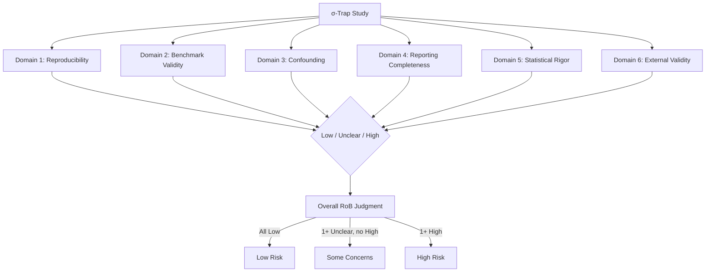
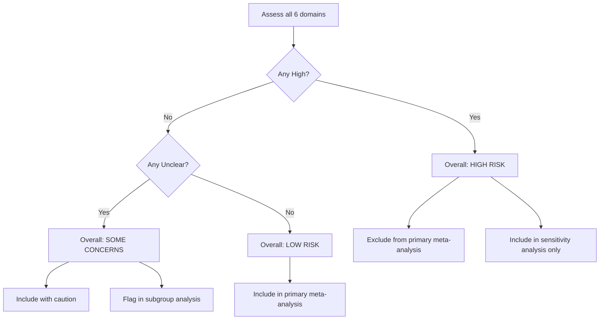

# Risk of Bias Assessment Tool: σ-ROB

**Document type:** Reference — feeds Phase 8 (Quality Assessment)
**Purpose:** Adapted risk of bias tool for ML experiments on the σ-trap, incorporating 6 domains with signaling questions, scoring rubrics, and embedded extraction forms
**Status:** Draft
**Cross-references:** `review-methodology.md` §3 (ROB tools), `extraction-template.md` §5 (IRR protocol), `meta-analysis-feasibility.md` §8 (SAP, sensitivity analyses), `empirical-evidence.md` (evidence gaps)

---

## 0. Overview and Rationale

This tool is adapted from QUADAS-2, ROBINS-I, and PROBAST+AI, but specifically designed for machine learning experiments where the "study" is a computational experiment, the "intervention" is a training regime (e.g., σ-targeting vs. standard SGD), and the "outcome" is OOD generalization performance. The σ-trap context requires special attention to reproducibility, benchmark validity, and statistical rigor because ML studies often lack the standardized protocols of clinical trials.

**Key adaptations from established tools:**
- From **QUADAS-2**: Domain structure, signaling questions, overall judgment flow
- From **ROBINS-I**: Pre-intervention (confounding, selection), at-intervention (implementation), post-intervention (detection, reporting) framework
- From **PROBAST+AI**: ML-specific concerns (data leakage, model evaluation, fairness)
- **Novel domain**: Benchmark validity (analogous to "reference standard" in QUADAS-2 but adapted for OOD evaluation)

**General principles:**
1. Bias is assessed at the **study level**, not the outcome level
2. Each domain is judged independently: **Low**, **Unclear**, or **High** risk of bias
3. Judgments are based on **explicit criteria**, not subjective impressions
4. "Unclear" should be used sparingly—only when information is genuinely missing after full-text review
5. The assessment is **not** a quality score; domains are not summed

---

## 1. Domain 1 — Reproducibility

### 1.1 Rationale
ML experiments are computational, not physical. Perfect reproducibility is achievable in principle, but in practice, missing seeds, code, or hyperparameters make results unverifiable. This domain assesses whether the experiment can be independently reproduced.

### 1.2 Signaling Questions

| SQ | Question | Yes / No / Unclear |
|---|---|---|
| 1.1 | Are random seeds explicitly reported for all experiments? | |
| 1.2 | Is the exact code (or pseudocode sufficient for reimplementation) publicly available? | |
| 1.3 | Are all training hyperparameters reported (learning rate, batch size, epochs, optimizer, weight decay, ρ for SAM, etc.)? | |
| 1.4 | Is the exact dataset version/preprocessing pipeline reported? | |
| 1.5 | Is the hardware/compute environment reported or implied? | |
| 1.6 | Are model weights/checkpoints available? | |

### 1.3 Scoring Rubric

| Rating | Criteria |
|---|---|
| **Low risk** | All of: (a) Seeds reported for all experiments, (b) Code available OR all hyperparameters explicitly reported, (c) Dataset version specified. Model weights and hardware are not required if code+data+hyperparameters are present. |
| **Unclear risk** | Code not available but hyperparameters mostly reported; OR seeds partially reported (e.g., "we use 3 seeds" but seed values not given); OR dataset version ambiguous. |
| **High risk** | Any of: (a) No seeds reported, (b) No code and incomplete hyperparameters, (c) Critical preprocessing steps undocumented, (d) Dataset version cannot be identified. |

### 1.4 Extraction Form

**Random seeds reported?**
- [ ] Yes (all experiments) — list values: _______________
- [ ] Yes (partial) — which: _______________
- [ ] No
- [ ] Unclear

**Code availability?**
- [ ] Yes (public repo) — URL: _______________
- [ ] Yes (upon request)
- [ ] No
- [ ] Unclear
- Language/Framework: _______________

**Hyperparameters reported?**
- [ ] All critical hyperparameters
- [ ] Most
- [ ] Few
- [ ] None
- [ ] Unclear
- Missing critical hyperparameters: _______________
- Learning rate: _______ Batch size: _______ Epochs: _______
- Optimizer: _______ Weight decay: _______
- SAM-specific: ρ = _______ η = _______

**Dataset version specified?**
- [ ] Yes — dataset name/version: _______________
- [ ] No
- [ ] Unclear
- Preprocessing steps documented: [ ] Fully [ ] Partially [ ] No

**Compute environment reported?**
- [ ] Yes
- [ ] No
- [ ] Unclear
- Hardware: _______________
- Software versions: _______________

**Model weights available?**
- [ ] Yes — URL: _______________
- [ ] No
- [ ] N/A

**Domain 1 Judgment:** [ ] Low [ ] Unclear [ ] High
**Rationale:** _______________

---

## 2. Domain 2 — Benchmark Validity

### 2.1 Rationale
In ML, the "reference standard" is the benchmark and its evaluation protocol. An inappropriate OOD split or metric can produce misleading conclusions about σ-trap dynamics. This domain assesses whether the benchmark actually measures what it claims to measure (OOD generalization, compositional generalization, etc.).

### 2.2 Signaling Questions

| SQ | Question | Yes / No / Unclear |
|---|---|---|
| 2.1 | Is the OOD split explicitly defined and justified (e.g., novel compositions, domain shift, covariate shift)? | |
| 2.2 | Does the OOD split avoid information leakage from training to test? | |
| 2.3 | Is the primary metric appropriate for the task (e.g., accuracy for classification, exact match for parsing, not loss)? | |
| 2.4 | Are multiple OOD splits tested (to avoid single-split cherry-picking)? | |
| 2.5 | Is the benchmark difficulty appropriate (not trivially solvable, not impossible)? | |
| 2.6 | Is the ID-OOD comparison computed on the same metric and same test-set size? | |

### 2.3 Scoring Rubric

| Rating | Criteria |
|---|---|
| **Low risk** | All of: (a) OOD split clearly defined and appropriate for the claimed shift type, (b) No evidence of leakage, (c) Appropriate metric, (d) ≥2 OOD splits tested OR justification for single split. |
| **Unclear risk** | OOD split defined but justification weak; OR only 1 OOD split tested without justification; OR metric appropriateness ambiguous. |
| **High risk** | Any of: (a) OOD split undefined or inappropriate (e.g., "OOD" is actually ID with noise), (b) Evidence of data leakage, (c) Inappropriate metric (e.g., using loss instead of accuracy for classification comparison), (d) Only best OOD split reported out of many tested. |

### 2.4 Extraction Form

**OOD split definition:**
- Split type: [ ] Compositional [ ] Covariate shift [ ] Concept shift [ ] Domain shift [ ] Adversarial [ ] Temporal [ ] Other: _______
- Definition provided: [ ] Yes [ ] No [ ] Unclear
- Quote from paper: "_____________"
- Justification for split appropriateness: [ ] Adequate [ ] Weak [ ] None

**Data leakage check:**
- Evidence of leakage: [ ] None found [ ] Possible [ ] Confirmed [ ] Unclear
- Leakage type (if any): _______________

**Primary metric:**
- Metric used: _______________
- Appropriate for task? [ ] Yes [ ] No [ ] Unclear
- If no, why not? _______________

**Multiple OOD splits:**
- Number of OOD splits tested: _______________
- All splits reported? [ ] Yes [ ] No (only best) [ ] Unclear
- If selective, which splits omitted? _______________

**Benchmark difficulty:**
- ID accuracy of baseline: _______________
- OOD accuracy of baseline: _______________
- Is the task non-trivial? [ ] Yes [ ] No (ceiling) [ ] No (chance) [ ] Unclear

**ID-OOD comparability:**
- Same metric for ID and OOD? [ ] Yes [ ] No [ ] Unclear
- Same test-set size? [ ] Yes [ ] No [ ] Unclear [ ] N/A

**Domain 2 Judgment:** [ ] Low [ ] Unclear [ ] High
**Rationale:** _______________

---

## 3. Domain 3 — Confounding

### 3.1 Rationale
In ML experiments, confounding arises when the intervention (e.g., σ-targeting) is not isolated from other factors that affect OOD generalization. Common confounders include architecture differences, compute budget, dataset size, and training duration. This domain assesses whether comparisons are fair.

### 3.2 Signaling Questions

| SQ | Question | Yes / No / Unclear |
|---|---|---|
| 3.1 | Is the architecture identical between intervention and baseline (except for the intervention itself)? | |
| 3.2 | Is the compute budget (FLOPs, training time, parameter count) matched between intervention and baseline? | |
| 3.3 | Is the training data identical between intervention and baseline? | |
| 3.4 | Is the training duration (epochs/steps) matched? | |
| 3.5 | Are other hyperparameters (learning rate, batch size, regularization) tuned equally for both conditions? | |
| 3.6 | If multiple interventions are compared, is there a common baseline? | |

### 3.3 Scoring Rubric

| Rating | Criteria |
|---|---|
| **Low risk** | All of: (a) Same architecture, (b) Compute matched (±10%), (c) Same data, (d) Same training duration, (e) Hyperparameters tuned fairly for both. |
| **Unclear risk** | One confounder not clearly addressed (e.g., training duration not stated); OR compute budget difference <2× but not explicitly justified. |
| **High risk** | Any of: (a) Different architecture between conditions, (b) Compute budget differs >2× without justification, (c) Different training data, (d) Hyperparameters tuned only for intervention, (e) No common baseline in multi-intervention comparison. |

### 3.4 Extraction Form

**Architecture matching:**
- Same architecture? [ ] Yes [ ] No [ ] Unclear
- If no, differences: _______________

**Compute budget:**
- Intervention FLOPs: _______________ Baseline FLOPs: _______________
- Intervention GPU-hours: _______________ Baseline GPU-hours: _______________
- Matched? [ ] Yes (±10%) [ ] No [ ] Unclear [ ] Not reported

**Training data:**
- Same training set? [ ] Yes [ ] No [ ] Unclear

**Training duration:**
- Intervention epochs/steps: _______________ Baseline epochs/steps: _______________
- Matched? [ ] Yes [ ] No [ ] Unclear
- If no, justification: _______________

**Hyperparameter tuning:**
- Tuned for both conditions? [ ] Yes [ ] No [ ] Unclear
- Search space reported? [ ] Yes [ ] No [ ] Unclear

**Common baseline (if multi-intervention):**
- Multiple interventions compared? [ ] Yes [ ] No
- If yes, common baseline? [ ] Yes [ ] No [ ] N/A
- Baseline type: _______________

**Domain 3 Judgment:** [ ] Low [ ] Unclear [ ] High
**Rationale:** _______________

---

## 4. Domain 4 — Reporting Completeness

### 4.1 Rationale
Selective reporting of positive results (or omission of negative OOD splits) introduces bias. This domain assesses whether the study reports all relevant outcomes, including negative results and failed experiments.

### 4.2 Signaling Questions

| SQ | Question | Yes / No / Unclear |
|---|---|---|
| 4.1 | Are all tested OOD splits reported (not just the best-performing one)? | |
| 4.2 | Are negative or null results reported? | |
| 4.3 | Are all tested architectures/model scales reported? | |
| 4.4 | Are hyperparameter search failures reported? | |
| 4.5 | Is the full confusion matrix or per-class accuracy available? | |
| 4.6 | Are results from all random seeds reported (not just best seed)? | |

### 4.3 Scoring Rubric

| Rating | Criteria |
|---|---|
| **Low risk** | All of: (a) All OOD splits reported, (b) Negative results reported, (c) All seeds reported, (d) Full results table or confusion matrix available. |
| **Unclear risk** | Some results omitted without clear justification; OR only best seed reported but multiple seeds run; OR confusion matrix not available but per-class accuracy is. |
| **High risk** | Any of: (a) Only best OOD split reported, (b) Only positive results reported, (c) Only best seed reported without justification, (d) Critical results (e.g., failed hyperparameter configurations) omitted. |

### 4.4 Extraction Form

**OOD split reporting:**
- Number of splits tested: _______________
- Number of splits reported: _______________
- All splits reported? [ ] Yes [ ] No [ ] Unclear

**Negative results:**
- Negative results reported? [ ] Yes [ ] No [ ] Unclear
- Examples: _______________

**Architecture/scale reporting:**
- All architectures tested? [ ] Yes [ ] No [ ] Unclear [ ] N/A
- All model scales tested? [ ] Yes [ ] No [ ] Unclear [ ] N/A

**Result detail:**
- Confusion matrix available? [ ] Yes [ ] No [ ] Partial
- Per-class accuracy? [ ] Yes [ ] No [ ] Partial
- Full results table? [ ] Yes [ ] No

**Seed reporting:**
- All seeds reported? [ ] Yes [ ] No (best only) [ ] No (mean only) [ ] Unclear
- Number of seeds run: _______________
- Number of seeds reported: _______________

**Domain 4 Judgment:** [ ] Low [ ] Unclear [ ] High
**Rationale:** _______________

---

## 5. Domain 5 — Statistical Rigor

### 5.1 Rationale
ML studies often report point estimates without uncertainty quantification. This domain assesses whether the study provides appropriate statistical evidence for its claims, including confidence intervals, multiple seeds, and significance testing.

### 5.2 Signaling Questions

| SQ | Question | Yes / No / Unclear |
|---|---|---|
| 5.1 | Are confidence intervals or standard errors reported for all key results? | |
| 5.2 | Are error bars shown on plots? | |
| 5.3 | Are multiple random seeds used (≥3)? | |
| 5.4 | Is the number of seeds justified by a power analysis or effect size estimate? | |
| 5.5 | Are statistical significance tests performed? | |
| 5.6 | Are multiple testing corrections applied when appropriate? | |
| 5.7 | Is the effect size (not just p-value) reported? | |

### 5.3 Scoring Rubric

| Rating | Criteria |
|---|---|
| **Low risk** | All of: (a) CIs or SEs reported, (b) ≥3 seeds, (c) Significance tests with correction, (d) Effect size reported. |
| **Unclear risk** | 1–2 seeds only; OR CIs reported for some but not all results; OR significance test without correction; OR effect size not reported. |
| **High risk** | Any of: (a) Single seed, (b) No uncertainty quantification, (c) No significance testing, (d) Multiple testing without correction. |

### 5.4 Extraction Form

**Uncertainty quantification:**
- CIs reported? [ ] Yes (all) [ ] Yes (some) [ ] No [ ] Unclear
- SEs reported? [ ] Yes (all) [ ] Yes (some) [ ] No [ ] Unclear
- CI type: [ ] Bootstrap [ ] Normal approx. [ ] Other: _______________

**Error bars on plots:**
- Present? [ ] Yes [ ] No [ ] Partial [ ] No plots
- Type: [ ] SD [ ] SEM [ ] 95% CI [ ] Other: _______________

**Multiple seeds:**
- Number of seeds: _______________
- Justified? [ ] Yes [ ] No [ ] Unclear [ ] N/A

**Power analysis:**
- Conducted? [ ] Yes [ ] No [ ] Unclear [ ] N/A

**Significance testing:**
- Performed? [ ] Yes [ ] No [ ] Unclear
- Test type: [ ] t-test [ ] Wilcoxon [ ] Bootstrap [ ] Permutation [ ] Friedman [ ] ANOVA [ ] Other: _______________
- p-value reported? [ ] Yes [ ] No [ ] Some

**Multiple testing correction:**
- Applied? [ ] Yes [ ] No [ ] Unclear [ ] N/A
- Method: [ ] Bonferroni [ ] Holm [ ] BH [ ] Other: _______________

**Effect size:**
- Reported? [ ] Yes [ ] No [ ] Unclear
- Type: [ ] Cohen's d [ ] Hedges' g [ ] LOR [ ] Δ accuracy [ ] Other: _______________
- Value: _______________

**Domain 5 Judgment:** [ ] Low [ ] Unclear [ ] High
**Rationale:** _______________

---

## 6. Domain 6 — External Validity

### 6.1 Rationale
A finding may be internally valid but fail to generalize beyond the specific benchmark, architecture, or training setup. This domain assesses whether the study's conclusions are likely to hold in other settings.

### 6.2 Signaling Questions

| SQ | Question | Yes / No / Unclear |
|---|---|---|
| 6.1 | Are results replicated on multiple benchmarks? | |
| 6.2 | Are results replicated across multiple architectures? | |
| 6.3 | Are results replicated across multiple model scales? | |
| 6.4 | Are results replicated across multiple training data sizes? | |
| 6.5 | Is the OOD split type representative of real-world distribution shifts? | |
| 6.6 | Does the study discuss limitations to generalizability? | |

### 6.3 Scoring Rubric

| Rating | Criteria |
|---|---|
| **Low risk** | All of: (a) ≥2 benchmarks, (b) ≥2 architectures, (c) Results consistent across settings, (d) Limitations discussed. |
| **Unclear risk** | Single benchmark but multiple architectures; OR multiple benchmarks but single architecture; OR inconsistent results across settings without explanation. |
| **High risk** | Any of: (a) Single benchmark, single architecture, (b) Results inconsistent across settings and not explained, (c) No discussion of generalizability. |

### 6.4 Extraction Form

**Multiple benchmarks:**
- Number of benchmarks tested: _______________
- List: _______________
- Consistent results? [ ] Yes [ ] No [ ] Partial [ ] Unclear

**Multiple architectures:**
- Number of architectures tested: _______________
- List: _______________
- Consistent results? [ ] Yes [ ] No [ ] Partial [ ] Unclear

**Multiple model scales:**
- Scales tested: [ ] Small [ ] Medium [ ] Large [ ] XL [ ] N/A
- Consistent results? [ ] Yes [ ] No [ ] Partial [ ] Unclear

**Multiple training data sizes:**
- Sizes tested: _______________
- Consistent results? [ ] Yes [ ] No [ ] Partial [ ] Unclear [ ] N/A

**Real-world shift representativeness:**
- Shift type: _______________
- Real-world relevance discussed? [ ] Yes [ ] No [ ] Unclear

**Limitations discussion:**
- Present? [ ] Yes [ ] No [ ] Unclear
- Key limitations stated: _______________

**Domain 6 Judgment:** [ ] Low [ ] Unclear [ ] High
**Rationale:** _______________

---

## 7. Overall Risk of Bias Judgment

### 7.1 Algorithm

### 7.2 Summary Form

| Domain | Judgment | Key Rationale |
|---|---|---|
| 1. Reproducibility | [ ] Low [ ] Unclear [ ] High | _______________ |
| 2. Benchmark Validity | [ ] Low [ ] Unclear [ ] High | _______________ |
| 3. Confounding | [ ] Low [ ] Unclear [ ] High | _______________ |
| 4. Reporting Completeness | [ ] Low [ ] Unclear [ ] High | _______________ |
| 5. Statistical Rigor | [ ] Low [ ] Unclear [ ] High | _______________ |
| 6. External Validity | [ ] Low [ ] Unclear [ ] High | _______________ |

**Overall Judgment:**
- [ ] Low Risk of Bias (all domains Low)
- [ ] Some Concerns (1+ Unclear, no High)
- [ ] High Risk of Bias (1+ High)

**Meta-analysis Inclusion:**
- [ ] Include in primary analysis
- [ ] Include with caution (flag in subgroup analysis)
- [ ] Exclude from primary, include in sensitivity analysis only
- [ ] Exclude entirely

**Notes:** _______________

**Paper ID:** _________ **Extractor:** _________ **Date:** _________
**Second Extractor:** _________ **Date:** _________ **Consensus:** _________ **Date:** _________

---

## 8. Inter-Rater Reliability Protocol

### 8.1 Training Phase
1. All extractors complete a 2-hour training session using 5 calibration papers
2. Inter-rater agreement target: Cohen's κ ≥ 0.70 for domain judgments
3. If κ < 0.70, revise criteria and retrain

### 8.2 Ongoing Monitoring
1. Double-code all papers (two independent extractors)
2. Resolve disagreements by consensus
3. Escalate persistent disagreements to third extractor (senior reviewer)
4. Monitor κ on every 20th paper to detect drift

### 8.3 Disagreement Resolution
1. Both extractors review the full text together
2. If disagreement persists, third extractor decides
3. Log all disagreements and resolutions for transparency

### 8.4 Disagreement Log Template

| Paper ID | Domain | Extractor 1 | Extractor 2 | Resolution | Reason |
|---|---|---|---|---|---|
| P001 | D1 | Low | High | High (3rd extractor) | No seeds reported |

---

## 9. Quality Assurance Checklist

Before finalizing a RoB assessment:

- [ ] All 6 domains assessed
- [ ] Signaling questions answered for each domain
- [ ] Domain judgment supported by specific evidence from the paper
- [ ] Overall judgment follows the algorithm (§7.1)
- [ ] Meta-analysis inclusion decision recorded
- [ ] Disagreements resolved and logged
- [ ] Assessment dated and signed by both extractors

---

## 10. Adaptation Notes

### 10.1 Key Differences from Source Tools

| Source Tool | Key Adaptation |
|---|---|
| **QUADAS-2** | "Patient selection" → "Benchmark selection"; "Index test" → "Intervention"; "Reference standard" → "OOD evaluation protocol"; "Flow and timing" → "Statistical rigor" |
| **ROBINS-I** | "Confounding" retained; "Selection" → "Architecture/data matching"; "Implementation" → "Training regime fidelity"; "Detection" → "Metric appropriateness"; "Reporting" → "Reporting completeness" |
| **PROBAST+AI** | "Participants" → "Training data"; "Predictors" → "Input features"; "Outcome" → "OOD accuracy"; "Analysis" → "Statistical rigor + Reproducibility" |

### 10.2 Novel Elements

- **Reproducibility domain**: Not present in QUADAS-2 or ROBINS-I; critical for ML where computational reproducibility is achievable but often unverified
- **Benchmark validity domain**: Adapted from QUADAS-2 "reference standard" but extended to cover OOD split design, metric appropriateness, and leakage detection
- **External validity domain**: Adapted from ROBINS-I but with ML-specific generalization axes (benchmarks, architectures, scales, data sizes)
- **Statistical rigor domain**: More detailed than PROBAST+AI; explicitly addresses seeds, CIs, and multiple testing correction

---

## 11. Example Applications

### 11.1 High-Risk Study

> **Paper**: "SAM Improves OOD Generalization on ImageNet-C"
>
> **Domain 1 (ReproduCibility)**: **HIGH** — No seeds reported, no code available, hyperparameters partially reported
>
> **Domain 2 (Benchmark Validity)**: **LOW** — ImageNet-C is well-established, appropriate metric (accuracy), no leakage
>
> **Domain 3 (Confounding)**: **HIGH** — SAM uses 2× compute (two forward passes) but baseline not given equivalent compute budget
>
> **Domain 4 (Reporting Completeness)**: **UNCLEAR** — Only best of 5 corruption types reported; other results omitted
>
> **Domain 5 (Statistical Rigor)**: **HIGH** — Single seed, no CIs, no significance test
>
> **Domain 6 (External Validity)**: **HIGH** — Single benchmark, single architecture (ResNet-50), no scale variation
>
> **Overall**: **HIGH RISK OF BIAS**
> **Decision**: Exclude from primary meta-analysis; include in sensitivity analysis only

### 11.2 Low-Risk Study

> **Paper**: "A Systematic Comparison of SAM Variants for Domain Generalization"
>
> **Domain 1 (Reproducibility)**: **LOW** — Seeds reported (42, 123, 456, 789, 2024), code available on GitHub, all hyperparameters in appendix
>
> **Domain 2 (Benchmark Validity)**: **LOW** — Tests on PACS, OfficeHome, VLCS, TerraIncognita; appropriate metric; no leakage
>
> **Domain 3 (Confounding)**: **LOW** — Same architecture (ResNet-50), compute matched (both run 100 epochs), same data
>
> **Domain 4 (Reporting Completeness)**: **LOW** — All benchmarks reported, including negative results on TerraIncognita
>
> **Domain 5 (Statistical Rigor)**: **LOW** — 5 seeds, 95% CIs, Wilcoxon signed-rank test with Holm correction, Cohen's d reported
>
> **Domain 6 (External Validity)**: **LOW** — 4 benchmarks, 2 architectures (ResNet-50, ViT-B), 2 scales, limitations discussed
>
> **Overall**: **LOW RISK OF BIAS**
> **Decision**: Include in primary meta-analysis
